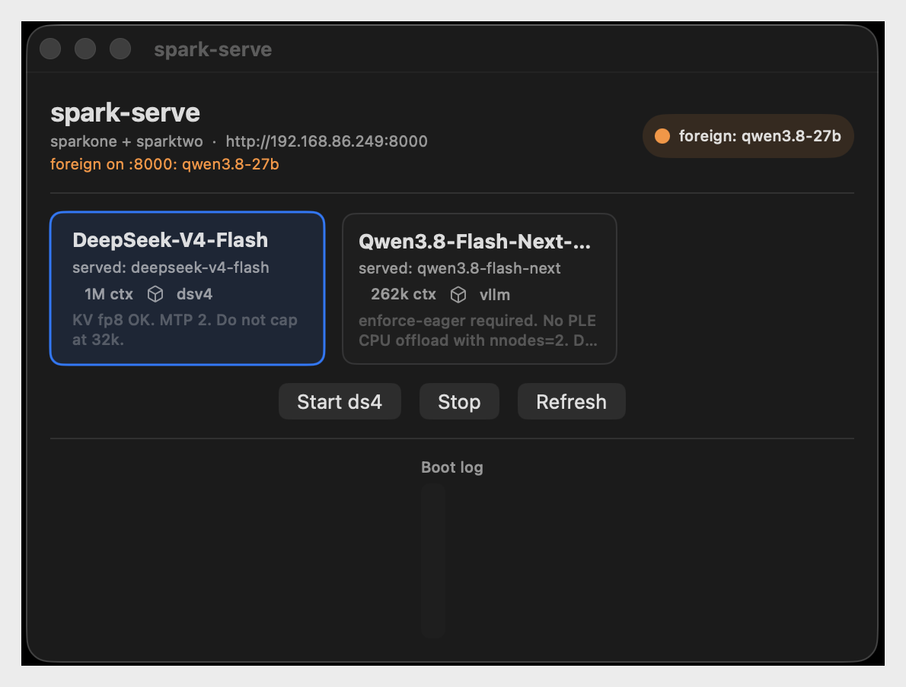

# spark-serve

Mac CLI + SwiftUI helper that remotely switches which catalogued vLLM model a
two-node [NVIDIA DGX Spark](https://www.nvidia.com/en-us/products/workstations/dgx-spark/)
cluster is serving.

**This is not how you set up a cluster.** Cabling, ConnectX-7 / QSFP, pairing
the Sparks, SSH, and the fabric are NVIDIA's docs, not this repo. Start at the
[DGX Spark user guide](https://docs.nvidia.com/dgx/dgx-spark/)
([system configuration and clustering](https://docs.nvidia.com/dgx/dgx-spark/system-config-and-operation.html)).
This project assumes that cluster already exists and the Mac can SSH to both
nodes. It only starts, stops, and swaps the vLLM recipe on the live endpoint.

The live OpenAI-compatible endpoint stays on the head node's LAN port 8000.
All SSH / docker / NCCL work lives in the Python CLI. The GUI is a thin
`Process` wrapper around that CLI.

<p align="center">
  
</p>

```
cp models.example.toml models.toml   # then edit [cluster]
./spark-serve list
./spark-serve status
./spark-serve up ds4
./spark-serve stop
./spark-serve logs -f
```

## Setup

1. Two Sparks with SSH aliases for head and worker (`BatchMode=yes`).
2. Python 3.11+ on the Mac (`tomllib`). The CLI re-execs `~/miniconda3/bin/python3`
   if `/usr/bin/python3` is too old.
3. Copy `models.example.toml` → `models.toml` and set:

   - `head` / `worker` — SSH hostnames
   - `master_addr` — QSFP / RoCE IP of the head (not the LAN NIC)
   - `lan_url` — URL clients use, e.g. `http://<head-lan-ip>:8000`
   - `hf_cache_host` — Hugging Face cache on the Sparks

`models.toml` is gitignored on purpose. Do not commit LAN IPs or SSH hostnames.

## Behaviour

`up` stops the previous cluster serve, starts the worker (rank 1, `--headless`)
then the head (rank 0), waits until the recipe is ready, then retargets Hermes
`spark` at the new served name if `~/.hermes/config.yaml` exists. Names in
`cluster.keep_containers` are never removed. Local oMLX / GLM on the Mac is
never touched. Catalog: text `ds4` and vision `ds4-vision` (FlyCockpit 0731). Only one owns `:8000` — see `docs/ds4-vision.md`.

`stop` (and `up`, before it starts a recipe) removes the catalogued vLLM
names **and** any other docker container on either node whose command binds
the serve port (sglang, leftover serves). Names in `keep_containers` are
never removed. If something still answers on `:8000` after that (bare
process, not docker), `stop` prints a note — that is not a failed stop.

`status` is ready only when the catalog containers are running **and**
`/v1/models` matches a catalogued `served_name`. JSON also reports
`foreign_served`, `ours_running`, `vllm_running`, and `port_busy`.

Add a model by copying a `[models.<id>]` table. `wrapper = "vllm"` for a stock
`vllm/vllm-openai:*` image (ENTRYPOINT already `vllm serve`). `wrapper = "dsv4"`
for the Aiden GB10 DeepSeek image.

Do not bake a sudo password in here. `up` drops page caches only if
passwordless sudo already works on the Sparks.

NCCL / UCX in the example catalog are pinned to the right-port QSFP rails
(`enp1s0f1`). Do not switch them back to f0 unless the cable moves.

## GUI

Menu-bar + window app. It shells out to this CLI (`list` / `status` / `up` /
`stop --json`); it does not speak SSH itself.

```
make -C gui
open gui/SparkServeApp.app
```

CLI path is resolved from the app bundle (`repo/gui/SparkServeApp.app` → repo)
or `SPARK_SERVE_HOME`. The app's `PATH` includes `~/miniconda3/bin` so the
`python3` shebang works under a GUI environment.

Requires Command Line Tools (`swiftc`); full Xcode is not needed.
