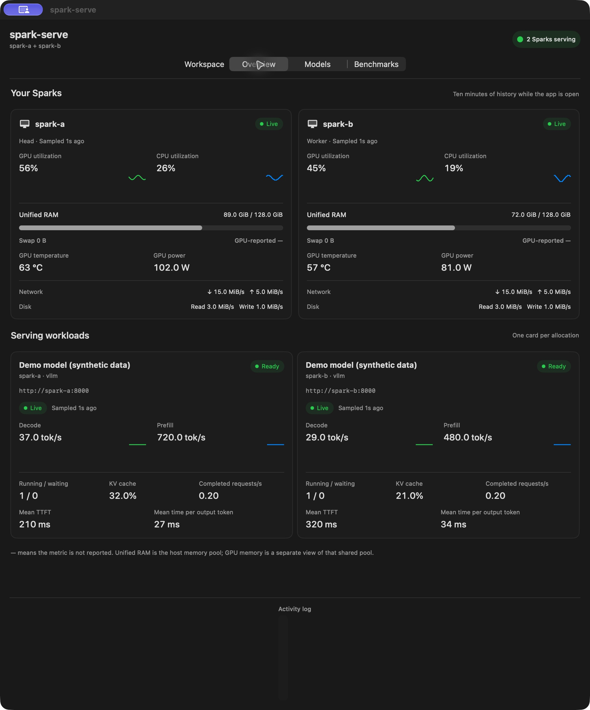
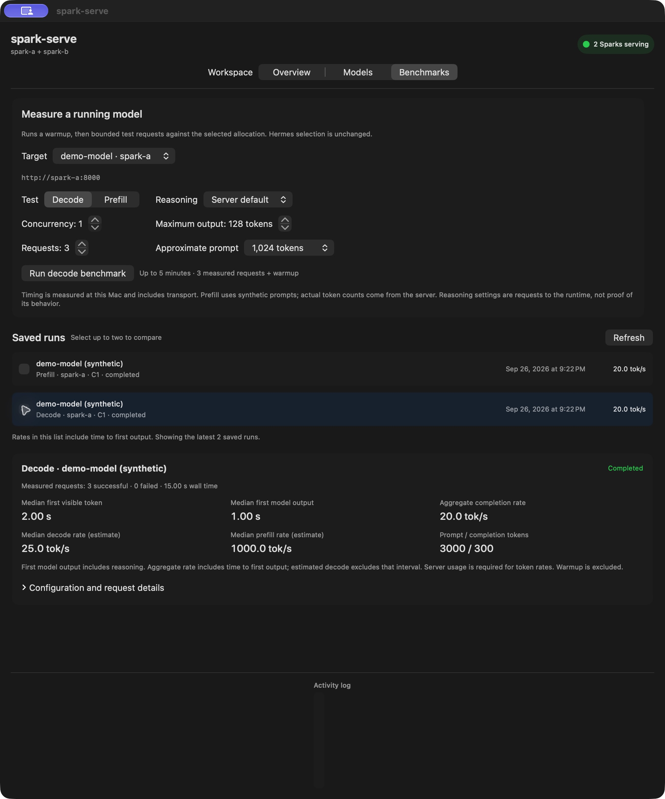
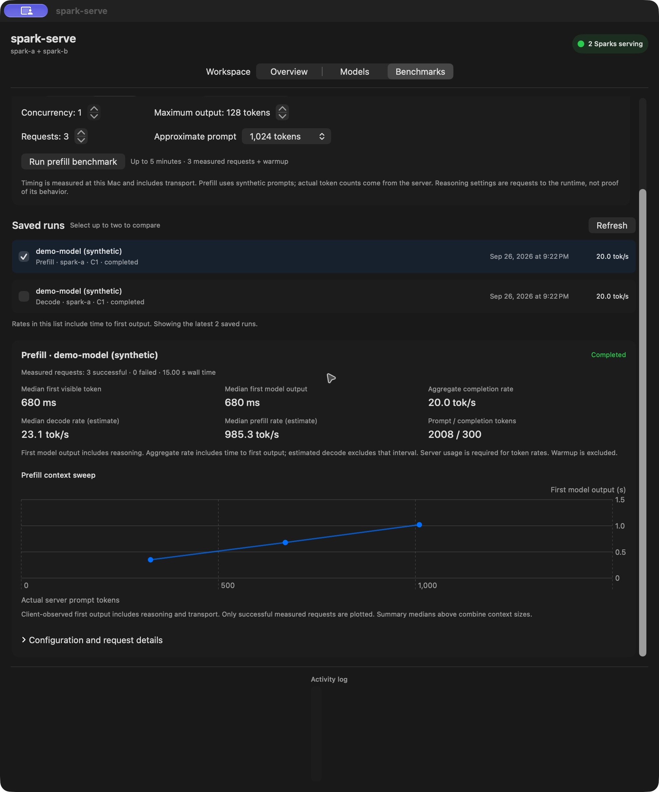
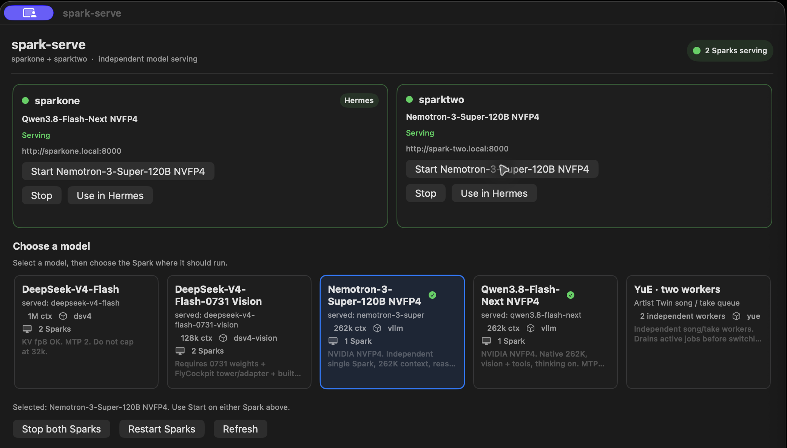
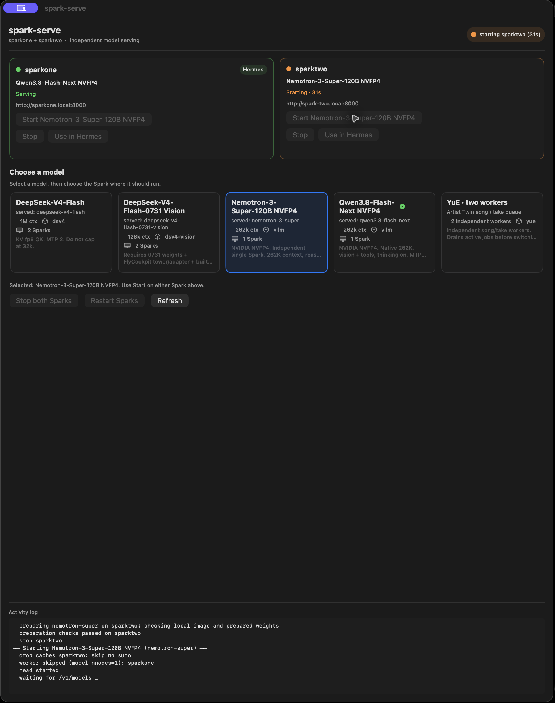
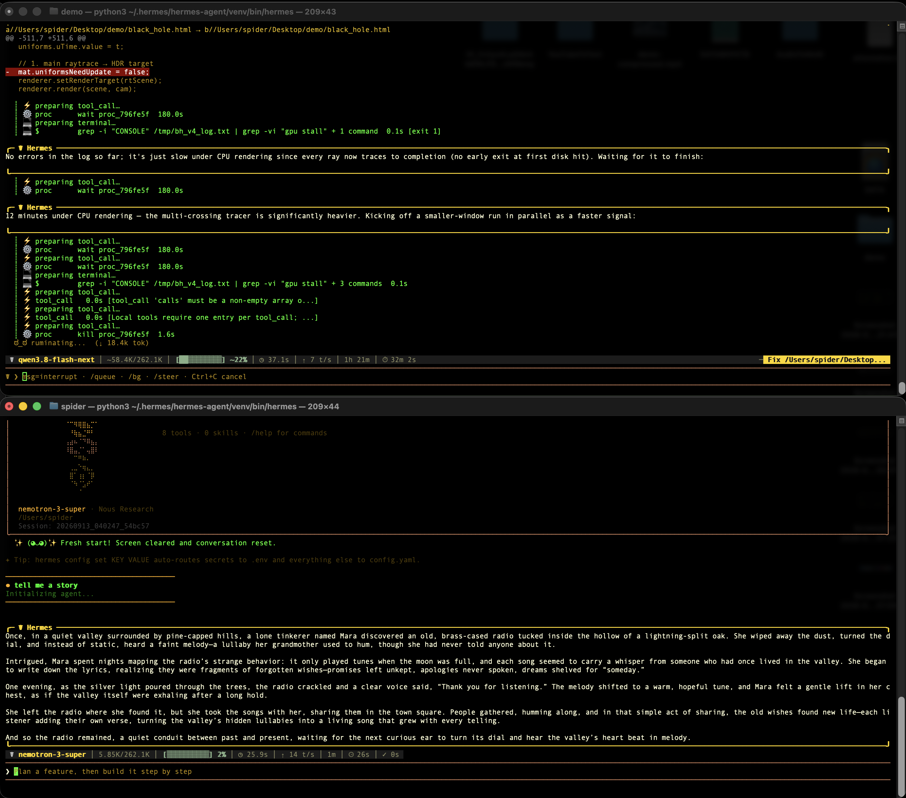

# spark-serve

Mac CLI + SwiftUI helper for catalogued vLLM models and independent YuE song
workers on a two-node [NVIDIA DGX Spark](https://www.nvidia.com/en-us/products/workstations/dgx-spark/)
cluster. Single-node models can run independently on each Spark.

**This is not how you set up a cluster.** Cabling, ConnectX-7 / QSFP, pairing
the Sparks, SSH, and the fabric are NVIDIA's docs, not this repo. Start at the
[DGX Spark user guide](https://docs.nvidia.com/dgx/dgx-spark/)
([system configuration and clustering](https://docs.nvidia.com/dgx/dgx-spark/system-config-and-operation.html)).
This project assumes that cluster already exists and the Mac can SSH to both
nodes. It controls workload ownership and starts, drains, stops, and swaps the
serving backend.

Each single-node model exposes an OpenAI-compatible endpoint on its Spark's LAN
port 8000. Distributed models expose their endpoint on the head.
YuE uses one HTTP worker per Spark on port 8011. The SwiftUI app uses the Python
CLI for workload control, live monitoring, and benchmarks. SSH, Docker, and NCCL
operations stay in that CLI.

The same native app includes live resource and inference metrics, topology-aware
allocation cards, and saved decode/prefill benchmarks. See
[native monitoring and benchmarks](docs/native-observability.md) for metric
definitions, cancellation behavior, and CLI usage.

Design rationale: [architecture decisions](docs/adr/README.md).

<p align="center">
  <a href="docs/screenshots/native-overview.jpg">
    
  </a><br>
  <em>Native Overview, captured September 26, 2026. Synthetic demo data illustrates the interface; these values are not hardware performance measurements.</em>
</p>

```
cp models.example.toml models.toml   # then edit [cluster]
./spark-serve list
./spark-serve status
./spark-serve up ds4
./spark-serve stop
./spark-serve reboot
./spark-serve logs -f
```

## Setup

1. Two Sparks with SSH aliases for head and worker (`BatchMode=yes`).
2. Python 3.11+ on the Mac (`tomllib`) and each Spark for live resource
   monitoring. The CLI re-execs `~/miniconda3/bin/python3` if
   `/usr/bin/python3` is too old.
3. Copy `models.example.toml` → `models.toml` and set:

   - `head` / `worker` — SSH hostnames
   - `master_addr` — QSFP / RoCE IP of the head (not the LAN NIC)
   - `lan_url` — URL clients use, e.g. `http://<head-lan-ip>:8000`
   - `worker_lan_url` — the second Spark's distinct model endpoint
   - `hf_cache_host` — Hugging Face cache on the Sparks

`models.toml` is gitignored on purpose. Do not commit LAN IPs or SSH hostnames.

## Model catalog

| Model | Sparks | Catalog context | Recipe |
|---|---:|---:|---|
| DeepSeek-V4-Flash | 2 | 1M | [Startup and recovery](docs/ds4-startup-recovery.md) |
| Nemotron-3-Super-120B NVFP4 | 1 | 262K | [Independent Spark setup](docs/nemotron-super.md) |
| Qwen3.8-Flash-Next NVFP4 | 1 | 262K | [Text, images and tools](docs/qwen38-nvfp4.md) |
| MiMo-V2.6-Flash-RL | 2 | 300K | [TP2, DFlash, official MXFP4 checkpoint](docs/mimo-v26-flash.md) |

Context values are catalog limits. Each recipe records the extent of its local
qualification; they are not guarantees for every workload at that size.

## Behaviour

`up ds4` drain YuE jobs, stop the previous workload, verify
both GPUs are free, start the worker (rank 1, `--headless`) and head (rank 0),
then retarget Hermes after readiness. Single-node recipes such as
`nemotron-super` and `qwen38` preserve their `nnodes=1` and TP=1 settings.
They default to the head, preserving any independent worker workload. Select
`--node worker` to use the second Spark. For example, keep Qwen on the head while
running `./spark-serve up nemotron-super --node worker`, then choose the client
with `./spark-serve use --node head` or `--node worker`. See
[independent Spark control](docs/independent-sparks.md) for setup and recovery.

Qwen3.8-Flash-Next uses NVIDIA NVFP4 weights, native 262K context, images and
tools on one Spark. Run `./spark-serve pull qwen38` to prepare its pinned
runtime and checkpoint, then `./spark-serve up qwen38`. It checks its assets
before stopping the current model. See the [Qwen recipe](docs/qwen38-nvfp4.md)
for setup, provenance and qualification details.

MiMo-V2.6-Flash-RL serves the official MXFP4 checkpoint on both Sparks with a
300K context. Run `./spark-serve pull mimo26`, then `./spark-serve up mimo26`.
Preparation downloads the weights on the head and copies that tree to the worker.
See the [MiMo recipe](docs/mimo-v26-flash.md).

`up yue` starts two **independent** workers. Each can render a different song or
take. This uses the existing SSH hosts and Mac app, while YuE keeps its own
inference pipeline and does not inject NCCL settings or change Hermes.

Every `up` and `stop` uses the same process lock and atomically persisted state
in `~/.local/state/spark-serve` (`SPARK_SERVE_STATE_DIR` overrides it). Discovery
is revoked before draining. Active renders keep running: the command reports
their job IDs and exits without starting a conflicting workload. Retry after
completion, or explicitly use `--cancel-jobs`. A failed/interrupted transition
stays visible. A solo change reconciles its selected node; distributed allocations
require both nodes together before a conflicting workload can start.
Each node also keeps a generation lock in `~/.local/state/spark-serve`; delayed SSH
commands for an older transition cannot admit a worker or launch a model after a
new transition starts. Commands hold that lock through their side effects,
including when a parent process is interrupted.

While a vLLM model starts, the CLI checks the exact containers it launched on
every required node. An exited container or an unverifiable node ends the wait
with its host and failure reason instead of leaving the app booting until the
readiness timeout. Before cleanup, bounded logs and container states are saved
under `~/.local/state/spark-serve/diagnostics/startup-*/failure.json` (or the
configured state directory) and shown in the app's boot log. The green model
check appears only after readiness; controls stay busy through cleanup.

See [DeepSeek startup recovery](docs/ds4-startup-recovery.md) for RDMA recovery,
the QSFP Socket fallback and validation results.

`reboot` drains like `stop`, then reboots both hosts with
`/usr/bin/systemctl reboot --no-block`. It uses passwordless sudo when that
binary is already NOPASSWD, otherwise `--sudo-password-stdin`. It does not add
or weaken sudoers rules. The cluster stays idle until the next `up`.

Only exact catalog-owned Docker IDs are stopped. `keep_containers` are retained,
including when accidentally listed in `stop_names`. Unreachable hosts, untracked
GPU containers, or remaining host compute processes block a mode switch. Stop
foreign workloads separately; Spark Serve does not claim ownership from a name
prefix or a port number.

`status --json` retains vLLM fields and adds per-node `nodes`, `active_node`, `mode`, `phase`, `transition_error`,
`yue_workers`, and `ready_workers`. Distributed vLLM readiness requires the expected
container on **both** nodes plus the expected served ID; a head-only response is
sufficient only for an explicitly single-node recipe. YuE readiness requires the
same worker identity and generation from control and HTTP, validated pinned assets,
CUDA, and admission. HTTP 200 alone is insufficient.

### Install the YuE workers

Install Artist Twin's protocol-v2 factory and pinned runtime/assets on each Spark
using its `scripts/spark` deployment instructions. The service must start drained;
do not enable autonomous admission or run the old v1 factory. This CLI checks the
source protocol marker before invoking controls, so an old script cannot mistake
`control status` for a request to start another server.

After copying the final factory payload and creating its systemd service, run
`control manifest` on each Spark with that service's environment. This inventories
the pinned weights, tokenizers, codecs, source, factory files, and Docker image.
`up yue` checks those assets and performs a CUDA/import probe before admission.
The factory must be upgraded on both nodes before switching to or from YuE.

Optionally add this **top-level** section to the private `models.toml`:

```toml
[yue]
head_url = "http://spark-head.lan:8011"
worker_url = "http://spark-worker.lan:8011"
# service = "yue-icl.service"
# factory_root = "~/.local/share/artist-twin/yue-factory"
# port = 8011
# ready_timeout = 180
```

Use LAN names/addresses resolvable from the Mac; SSH aliases alone need not be DNS
names. The default head URL reuses the host from `cluster.lan_url`; the worker URL
defaults to the configured SSH worker name. Unknown `[yue]` keys fail closed.
Credentials belong in environment variables, never the catalog or discovery.

```sh
./spark-serve up yue
./spark-serve status --json
./spark-serve stop                 # drain; blocks if a render is active
./spark-serve stop --cancel-jobs   # explicit cancellation and verified cleanup
./spark-serve up ds4              # drain YuE, release GPUs, start DeepSeek
```

Artist Twin reads the atomic public file
`~/.local/state/spark-serve/yue-workers.json`, not this private model catalog.
Its schema is `{version:1, mode:"yue", generation, workers:[{id,url,generation,
runtime_manifest}]}`. An unavailable mode publishes an empty worker list.
Worker IDs come from each factory's durable identity, not the SSH alias. Artist
Twin owns durable job/take dispatch, rights checks, seeds, downloads, and provenance.
Rebooted workers start drained and require `up yue` to validate and re-admit them.

Two workers improve throughput under load; they do not split a single song across
the fabric. Each factory still loads the model pipeline for each render. Single-song
latency and aggregate speedup need measurement on the installed Sparks.

### Measure YuE concurrency capacity

`python3 -m spark_bench concurrency` runs a controlled C1…CN experiment with the
same seeded corpus, per-job audio-integrity gates, raw telemetry and reproducible
throughput/latency analysis. Its isolated dispatcher leaves production concurrency
unchanged. Use `--ssh-host` to drain one configured Spark and hold workload ownership
through the experiment. See [the benchmark guide](docs/worker-concurrency-benchmark.md)
for workload setup, guards, raw results and the criteria for a capacity recommendation.

The [September 8 handover](docs/handover-2026-09-08.md) records the cooling pause,
preserved evidence, active replay and commands for resuming both investigations.

Add a model by copying a `[models.<id>]` table. `wrapper = "vllm"` for a stock
`vllm/vllm-openai:*` image (ENTRYPOINT already `vllm serve`). `wrapper = "dsv4"`
for the Aiden GB10 DeepSeek image.

Do not bake a sudo password in here. `up` drops page caches only if
passwordless sudo already works on the Sparks.

NCCL / UCX in the example catalog are pinned to the right-port QSFP rails
(`enp1s0f1`). Do not switch them back to f0 unless the cable moves.

## GUI

The native SwiftUI menu-bar and window app requires **macOS 13 or newer** on an
Apple Silicon Mac and Command Line Tools (`swiftc`); full Xcode is not needed.
Quit any running copy of Spark Serve, then build and open it from the repository
root:

```sh
make -f gui/Makefile
open gui/SparkServeApp.app
```

The window has three tabs:

- **Overview** shows CPU and GPU utilization charts, memory use, temperature,
  power, and network/disk rates for each physical Spark, plus inference metrics
  for each logical model allocation. A model shared across both Sparks has one
  inference endpoint.
- **Models** controls placement, start/stop, and Hermes selection. Prepare
  models with CLI `pull`; startup progress and failures appear in the activity log.
- **Benchmarks** runs bounded decode tests and prefill sweeps against a ready
  managed allocation, with reasoning settings, cancellation, saved history, and
  comparison of two runs. Warmup is separate; token counts come from the server.

The app invokes this CLI (`list`, `status`, `watch`, `bench`, `up`, `stop`, and
`reboot`) and does not speak SSH itself. Live monitoring starts with the app and
stops when it quits. Benchmarks start only when requested. The same interfaces
are available directly:

```sh
./spark-serve watch --json   # Ctrl-C to stop monitoring
./spark-serve bench run --node head --kind decode --requests 3 --json
./spark-serve bench list --json
```

See [native monitoring and benchmarks](docs/native-observability.md) for metric
semantics, limits, saved results, and cancellation behavior.

The YuE card and per-worker status show readiness, draining, and active work.
Regular Stop preserves active renders; “Cancel jobs & stop” is a separate
confirmed action. **Restart Sparks** drains, reboots both hosts
(`systemctl reboot --no-block`), and waits for SSH. Passwordless
`/usr/bin/systemctl` is used when sudoers already allows it; otherwise the
confirmation sheet’s sudo password is passed on stdin for that reboot only
and is not stored. This tool does not add or weaken sudoers rules. After reboot,
press Start to launch a catalog model again. A running CLI transition completes
before another one can begin.

The CLI path is resolved from the app bundle (`repo/gui/SparkServeApp.app` →
repo) or `SPARK_SERVE_HOME`. The app's `PATH` includes `~/miniconda3/bin` so the
`python3` shebang works under a GUI environment.

### Screenshots

The Overview above and Benchmarks below were captured from the native app on
**September 26, 2026**, using **synthetic demo data**. They illustrate the
interface and do not report hardware performance measurements. Click an image
to open it at full resolution.

<p align="center">
  <a href="docs/screenshots/native-benchmarks.jpg">
    
  </a><br>
  <em>Native Benchmarks: configure a test, select a saved run, and inspect latency and token rates. Synthetic demo data, September 26, 2026.</em>
</p>

<p align="center">
  <a href="docs/screenshots/native-prefill.jpg">
    
  </a><br>
  <em>Prefill context sweep and saved request statistics. Synthetic demo data, September 26, 2026.</em>
</p>

#### Earlier model-control screenshots — September 13, 2026

These earlier captures show independent model control and Hermes sessions.
They predate the Overview and Benchmarks tabs.

<p align="center">
  <a href="docs/screenshots/qwen-nemotron-serving.png">
    
  </a><br>
  <em>Qwen and Nemotron serving independently on two Sparks, with Hermes connected to Qwen.</em>
</p>

<p align="center">
  <a href="docs/screenshots/nemotron-starting.png">
    
  </a><br>
  <em>Starting Nemotron on the second Spark while Qwen continues serving on the first.</em>
</p>

<p align="center">
  <a href="docs/screenshots/hermes-qwen-nemotron-sessions.png">
    
  </a><br>
  <em>Two Hermes sessions: Qwen working on a coding task above, and Nemotron answering a story prompt below.</em>
</p>

## Acknowledgments

Thanks to [sparkDash](https://github.com/MiaAI-Lab/sparkDash) by
[Mia'a AI Lab](https://x.com/MiaAI_lab) for inspiring Spark Serve's live resource
and inference metrics, decode/prefill benchmark workflow, and topology overview.
Spark Serve implements these ideas in SwiftUI and its existing Python CLI,
using its own telemetry and streaming protocol code.

## Offline verification

```sh
python3 -m pytest tests -q
make -f gui/Makefile smoke
```

Fault-injection tests cover concurrent controllers, lost/offline ownership,
legacy migration, active-job draining, explicit cancellation, stale generations,
misrouted health, partial starts, exact-container cleanup, protected services,
and preservation of single-node/distributed vLLM recipes. Monitoring and benchmark
tests cover counter resets, stale data, cancellation, token accounting, and
bounded process cleanup. The native smoke test checks the Python-to-Swift data
contract. These checks submit no inference requests and change no Spark workloads.
